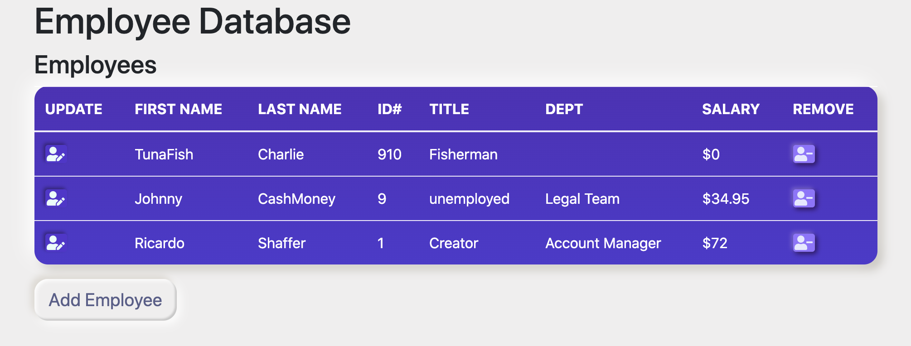
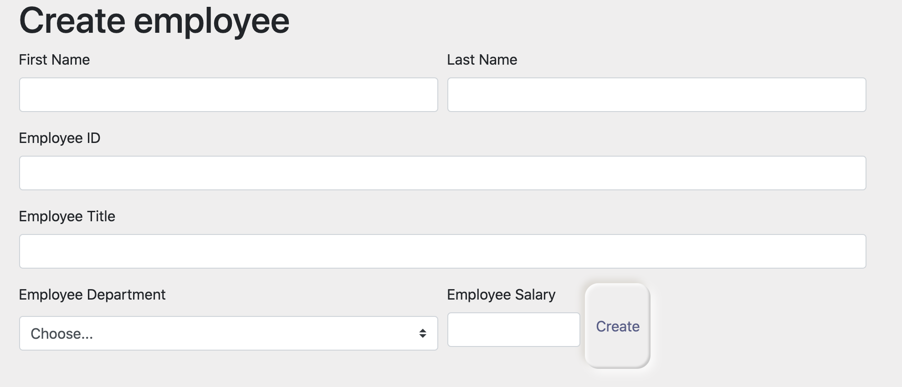
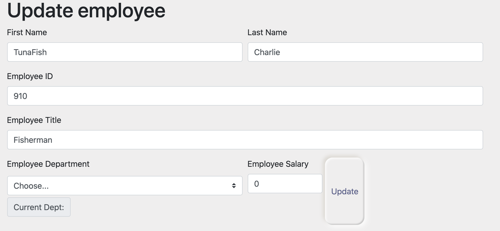

# employee-database
A publicly viewable sort-by option for react.js. Utilizes random files generated by API (see credits). Intended to substitute a CLI database (see project https://github.com/ricardoshaffer/employee-CLI

## Functionality
*   Landing page contains overview of all employees, their name, department, ID, salary. Employee can be updated using 'edit' button to the left of the employee's first name, or the employee can be removed by clicking on the 'delete' button on the right-hand column.

*   Adding an employee, will enable the user to fill in the blanks and select from a list of departments. Data is saved using mySQL DB.

*   Updating an employee requires the user to click on the 'edit' button (left of the employee's first name). 

## Deployment
*   Deployed at: https://employee-db-system.herokuapp.com/

## To Launch
*   Install missing modules using `<npm install>`
*   Clone file and do `<npm run>`
*   Create a Heroku app and sync with a mySql (JawsDB)

## Architecture
*   Built using react.js
*   Developed for mobile first with search by first name and sort-by column onClick.
*   Database set up to host on MySql.
*   Deployed using Heroku and JawsDB.

## Credits
*   Built using Bootstrap for React.js.
*   Utilizing random employee generator provided by [randomuser.me](https://randomuser.me/api/)
*   Built using React.js
